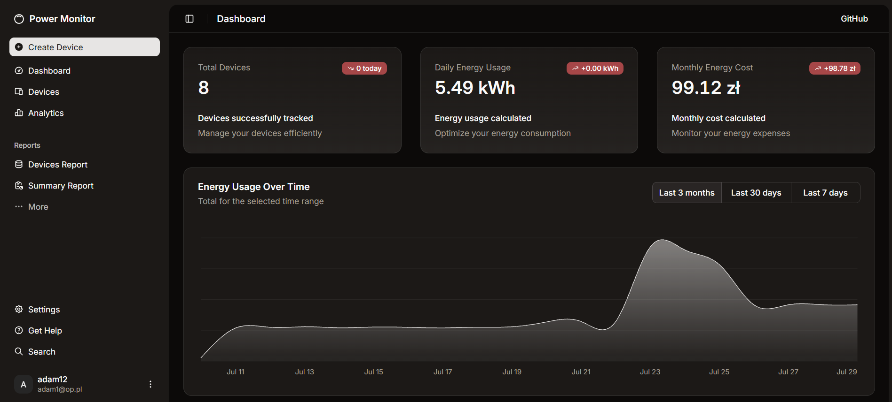
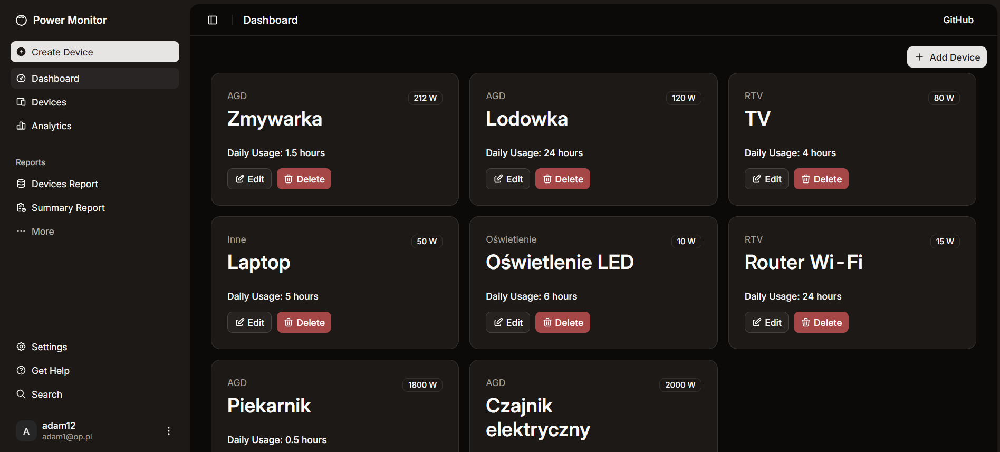
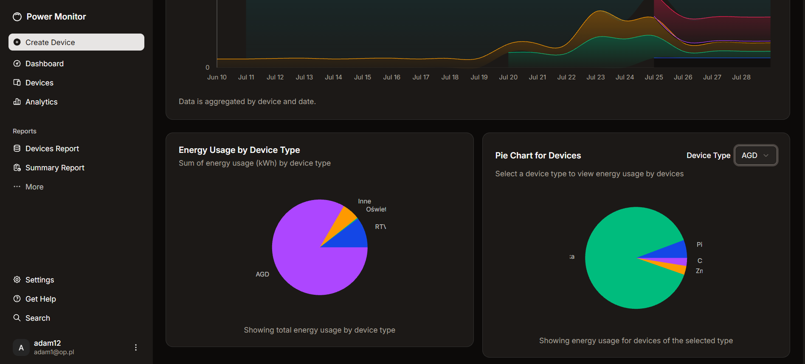
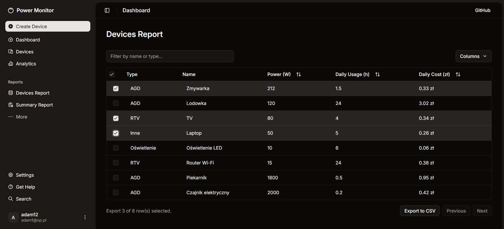
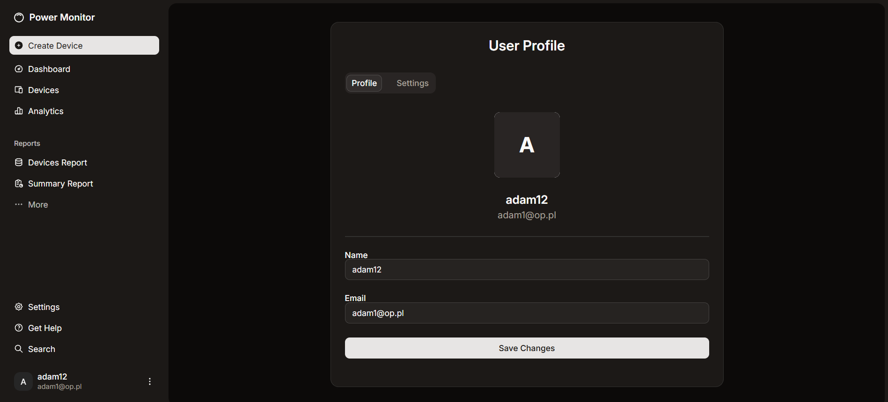
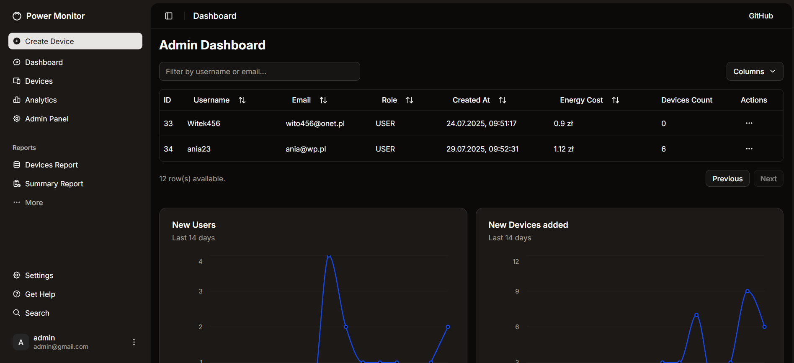

# Energy Monitor Application


---

## Overview

The Energy Monitor App is a full-stack application designed to monitor energy usage, manage devices, and provide analytics. The frontend is built with React and TypeScript, while the backend is powered by Java and Spring Boot.

---

## Features

### Frontend
- [Frontend README](frontend/README.md)
- User authentication and authorization
- Interactive dashboards and charts
- Device and energy usage management

### Backend
- [Backend README](backend/README.md)
- Secure user authentication
- Device and energy usage management
- Analytics and reporting

---

## Quick Start

### Frontend
1. Navigate to the frontend directory:
   ```bash
   cd energy-monitor-app/frontend
   ```
2. Install dependencies:
   ```bash
   npm install
   ```
3. Start the development server:
   ```bash
   npm run dev
   ```

### Backend
1. Navigate to the backend directory:
   ```bash
   cd energy-monitor-app/backend
   ```
2. Build the project:
   ```bash
   ./mvnw clean install
   ```
3. Run the application:
   ```bash
   ./mvnw spring-boot:run
   ```

---

## Screenshots

Here are screenshots of different pages of the application:

- **Dashboard**:
  

- **Devices**:
  

- **Analytics**:
  

- **Devices Report**:
  

- **Profile**:
  

- **Admin Panel**:
  

---

## Authors

- **Lukas** - [GitHub Profile](https://github.com/LukasZaw)

---

Feel free to contribute to this project by submitting issues or pull requests!